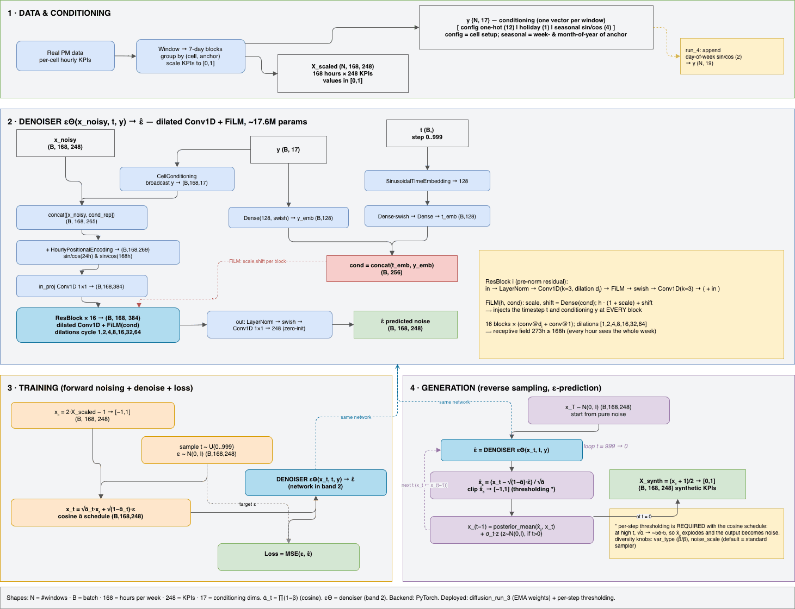
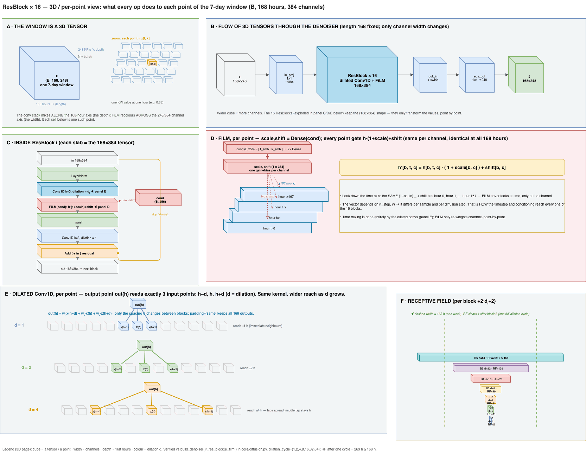

# cVAE-LSTM architecture history (v1 → v8)

This document preserves the design history of the conditional-VAE lineage that lives
(in its current, trimmed form) in `core/architectures.py`. Only **v6** and **v7** are
still implemented and wired into `core/model.py`'s builders — everything else here was
deleted from the code once superseded, but the reasoning is worth keeping: it explains
*why* v6/v7 look the way they do, and the GAN/diffusion families that came after them
inherited several of these lessons directly (conditioning shape, PE placement,
free-bits, KL annealing).

The throughline across the whole VAE era: **posterior collapse** — the decoder
learning to ignore `z` and reconstruct from `y` (or its own autoregressive state)
alone, which makes the KL term go to ~0 "for free" but kills sample diversity. Each
version is a response to a new way collapse showed up.

## v1 — `VAE_LSTMArchitecture` (unconditional) / `cVAE_LSTMArchitecture` (conditional)

Plain bidirectional-LSTM encoder + LSTM decoder, paired with the base `BetaVAE` /
`cBetaVAE` model classes. Conditional version: per-timestep latent of size
`latent_dim` (so the *total* latent vector is `latent_dim * seq_len` — one code per
hour, flattened). LSTM was chosen over Conv1D from the start because 168-hour
windows have temporal dependencies spanning the whole sequence, which convolutions
without huge receptive fields can't see.

## v2 — `cVAE_LSTMv2Architecture`

Added: `LayerNormalization` after every BiLSTM/LSTM layer, an optional temporal
self-attention block in the encoder after the LSTM stack, a "funnel" hidden-unit
schedule (`_funnel_schedule`: units shrink `hidden_dim // depth` per layer, dropout
rises per layer), and an attention `key_dim` computed from the actual BiLSTM output
width instead of a guess.

## v3 — `cVAE_LSTMv3Architecture`

Added `HourlyPositionalEncoding` (the 24h/168h sin/cos channels, still in use today)
to both encoder and decoder inputs, so the LSTM always knows where in the day/week
cycle it is — independent of the window stride used to build samples.

## v4 — `cVAE_LSTMv4Architecture`: global z

The first attempt at fixing collapse structurally. v1–v3 summed the KL over
`latent_dim × seq_len` (e.g. 32 × 168 = 5,376 dimensions) — even at `beta=1.0` that KL
pressure is enormous and drives posterior collapse within ~20 epochs. v4 instead pools
the encoder output with `GlobalAveragePooling1D` into a single global vector
`z ∈ R^latent_dim`, summing the KL over just `latent_dim` (64) dims — an 84× reduction.
Paired with slow KL annealing and free-bits in `cBetaVAE(global_z=True)`, which tiles
`z` from `(batch, latent_dim)` to `(batch, seq_len, latent_dim)` before concatenating
with the per-step label broadcast for the decoder.

## v5 — `cVAE_LSTMv5Architecture`: config conditioning replaces per-cell labels

This is where conditioning became **config-based** instead of a raw label/embedding —
the one-hot config + holiday + seasonal vector `y` (`CellConditioning`, broadcast per
timestep) that the whole pipeline still uses today. Cell identity (`distname`) was
dropped as a model input entirely from this point on. Optionally splits the latent
into global `z_g` (week-level) + local `z_l` (hour-level residuals) via `DualSampling`.
The decoder used `z_g` only as the LSTM's initial hidden/cell state `(h0, c0)`, with
per-step input being conditioning only (`+` optional `z_l`).

**Failure mode v6 had to fix:** an LSTM's gates can forget its initial state within a
few steps, so by hour 20-30 of a 168-hour window the decoder had effectively forgotten
`z_g` and was reconstructing from the conditioning broadcast alone — collapse, just
delayed rather than prevented.

## v6 — `cVAE_LSTMv6Architecture`: the collapse fix

Two structural changes, together sufficient to make collapse *structurally
impossible* rather than just discouraged:

1. **X-only encoder.** `q(z|X)` instead of `q(z|X, y)` — v5's encoder also saw `y`,
   giving it a shortcut to encode "which config is this" into `z` instead of "what
   shape is this week," which the decoder could reconstruct from `y` alone, making `z`
   informationally redundant. Removing `y` from the encoder forces `z` to carry
   `X`'s actual temporal structure.
2. **z tiled to every decoder step**, not just the initial LSTM state. `z_tiled`
   `(B, T, G)` is concatenated with the per-step conditioning at *every* timestep, so
   the gates cannot forget it the way they could an initial-state-only signal.

```
Encoder:    X → BiLSTM → attention → z          ("what kind of week is this?")
Decoder:    [z_tiled ‖ y] → LSTM(init=z) → X̂     (y shapes cell-specific output)
Generation: z ~ N(0,1) (diverse week pattern) + y = target config → diverse, config-conditioned X
```

This is the version `build_cvae_lstm` in `core/model.py` still builds today.

## v7 — `cVAE_LSTMv7Architecture` + `cBetaVAE_Hierarchical_v7`: per-KPI structure

v6 fixed *that* the decoder uses `z`, but two remaining issues were about *what the
decoder reconstructs*:

1. **Decoder PE removed** (kept in the encoder). `HourlyPositionalEncoding` in the
   *decoder* taught it a 24h sinusoid as a free, easy-to-learn pattern, independent of
   whether a given KPI actually has real periodicity — a spurious-sinusoid artifact.
   Removing it from the decoder (keeping it in the encoder, where it helps the model
   *recognise* timing without being a generation shortcut) fixed this without losing
   the encoder's positional awareness.
2. **`CrossKPICorrelation` residual layer** at the decoder output. KPIs were being
   generated independently per channel, missing real cross-KPI correlation. This
   layer learns an `F×F` mixing kernel as a residual correction — but unregularised it
   went dense (off-diagonal energy 4.6× the diagonal on one run), overstating
   correlation and leaking periodicity between unrelated KPIs. `corr_l2` (not L1 — L1's
   constant per-entry gradient crushed the kernel to ~0 regardless of magnitude; L2
   scales with the weight's own value, so it shrinks without zeroing out genuinely
   useful entries) keeps it sparse.
3. **Autocorrelation penalty** added directly to the ELBO (`_ac_penalty` in
   `cBetaVAE_Hierarchical_v7`, weight `ac_weight`, lags `1..ac_max_lag`). Plain
   reconstruction MSE is lag-0 only, so a decoder could minimise it while emitting
   near-white-noise within a window; penalising the AC curve directly forces real
   temporal structure (the diurnal/weekly correlation) to be reproduced, not just the
   per-hour mean.

This is the version `build_cvae_lstm_v7` in `core/model.py` still builds today, and
the one that was actually deployed (`scripts/run_training.py`'s `run_17`/`run_18`
lineage).

## v8 — never implemented, kept as a tuning recipe (`HP_V8` in `core/model.py`)

Same architecture as v7; a documented set of hyperparameter changes proposed after a
run-11 post-mortem (the unregularised `CrossKPICorrelation` kernel going dense, as
described above) — `corr_l2` added, `ac_weight` raised 0.1→0.3, capacity raised
(`hidden_dim` 256→384, `global_latent_dim` 64→128). No `build_cvae_lstm_v8` was ever
written; `HP_V8` is kept purely as the documented next-step recipe.

## Where the VAE line ends

A single-config diagnostic later proved that **within-config diversity collapse is
intrinsic to the VAE's (and the WGAN-GP's) objective**, not a conditioning or capacity
problem — a fully unconditional VAE/GAN trained on just the single largest config
collapsed the same way. This is what motivated the pivot to **diffusion** (DDPM,
`core/diffusion.py`): a denoising objective has no "ignore z, reconstruct from y"
shortcut, so it can't collapse by construction. See the diffusion module's docstring
and the project's GenPM modelling notes for that part of the story.

## Current (working) Architecture - Conditional DDPM
(DDPM_arch.png)


Scope on ResBlock + Dilated 1DConv + FiLM
(DDPM_arch_scope.png)

